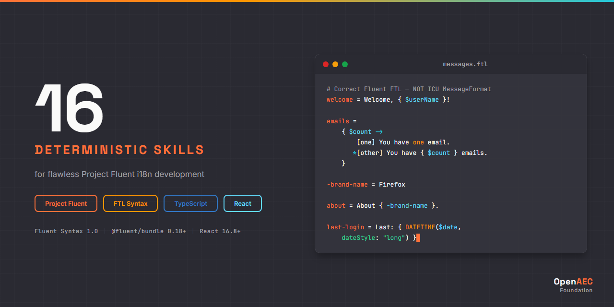

# Fluent i18n Claude Skill Package

<p align="center">
  
</p>


**16 deterministic Claude AI skills for Project Fluent localization — FTL syntax + TypeScript integration coverage.**

Built on the [Agent Skills](https://agentskills.org) open standard.

---

## Why This Exists

Without skills, Claude confuses Fluent FTL with ICU MessageFormat:

```
# Wrong — ICU MessageFormat syntax, NOT Fluent
welcome = Welcome, {username}! You have {count, plural, one {# message} other {# messages}}.
```

With this skill package, Claude produces correct Fluent FTL:

```ftl
# Correct — Fluent FTL syntax with proper select expression
welcome = Welcome, { $username }! You have { $count ->
    [one] { $count } message
   *[other] { $count } messages
}.
```

---

## Skills (16)

| Category | Count | Skills |
|----------|:-----:|--------|
| **fluent-core/** | 3 | architecture, bundle-api, langneg |
| **fluent-syntax/** | 5 | messages, selectors, terms, attributes, functions |
| **fluent-impl/** | 4 | react, locale-loading, locale-switching, project-setup |
| **fluent-errors/** | 2 | parsing, resolution |
| **fluent-agents/** | 2 | review, project-scaffolder |

See [INDEX.md](INDEX.md) for the complete skill catalog with descriptions and links.

## Technology Coverage

| Area | Topics | Package |
|------|--------|---------|
| **FTL Syntax** | Messages, placeables, selectors, terms, attributes, comments, functions | Fluent Syntax 1.0 |
| **Bundle API** | FluentBundle, FluentResource, formatPattern, getMessage, error handling | @fluent/bundle 0.18+ |
| **React Integration** | LocalizationProvider, Localized, useLocalization, DOM overlays, SSR | @fluent/react 0.15+ |
| **Language Negotiation** | negotiateLanguages, locale matching, fallback chains, Accept-Language | @fluent/langneg 0.7+ |
| **Error Handling** | Parse errors, resolution errors, debugging workflow, anti-patterns | All packages |

## Version Compatibility

| Package | Versions | Notes |
|---------|----------|-------|
| @fluent/bundle | **0.18+** (current: 0.19.1) | Core runtime |
| @fluent/react | **0.15+** (current: 0.15.2) | React bindings |
| @fluent/langneg | **0.7+** (current: 0.7.0) | Language negotiation |
| @fluent/syntax | **0.19+** (current: 0.19.0) | Parser/serializer (tooling) |

## Installation

### Claude Code

```bash
# Option 1: Clone the full package
git clone https://github.com/OpenAEC-Foundation/Fluent-i18n-Claude-Skill-Package.git
cp -r Fluent-i18n-Claude-Skill-Package/skills/source/ ~/.claude/skills/fluent/

# Option 2: Add as git submodule
git submodule add https://github.com/OpenAEC-Foundation/Fluent-i18n-Claude-Skill-Package.git .claude/skills/fluent
```

### Claude.ai (Web)

Upload individual SKILL.md files as project knowledge.

## Quick Start

After installation, skills activate automatically based on context:

- **Write FTL messages** — ask Claude to create localization files → activates `fluent-syntax-messages`
- **Add plurals** — handle plural forms → activates `fluent-syntax-selectors`
- **Set up React i18n** — integrate Fluent with React → activates `fluent-impl-react`
- **Debug parse errors** — paste an FTL error → activates `fluent-errors-parsing`
- **Scaffold a project** — set up i18n infrastructure → activates `fluent-agents-project-scaffolder`
- **Review code** — validate FTL + TypeScript → activates `fluent-agents-review`

## Documentation

| Document | Purpose |
|----------|---------|
| [INDEX.md](INDEX.md) | Complete skill catalog with links |
| [ROADMAP.md](ROADMAP.md) | Project status (single source of truth) |
| [REQUIREMENTS.md](REQUIREMENTS.md) | Quality guarantees and per-area requirements |
| [DECISIONS.md](DECISIONS.md) | Architectural decisions with rationale |
| [SOURCES.md](SOURCES.md) | Official reference URLs and verification rules |
| [WAY_OF_WORK.md](WAY_OF_WORK.md) | 7-phase development methodology |
| [LESSONS.md](LESSONS.md) | Lessons learned during development |
| [CHANGELOG.md](CHANGELOG.md) | Version history |

## Methodology

This package was developed using the **7-phase research-first methodology**, proven across multiple skill packages:

1. **Setup + Raw Masterplan** — Project structure and governance files
2. **Deep Research** — Comprehensive analysis of Fluent specification, source code, and community resources
3. **Masterplan Refinement** — Skill inventory refinement based on research findings
4. **Topic-Specific Research** — Deep-dive per skill topic
5. **Skill Creation** — Deterministic skill files following Agent Skills standard
6. **Validation** — Correctness, completeness, and consistency checks
7. **Publication** — GitHub release and documentation

## Related Projects

| Project | Description |
|---------|-------------|
| [ERPNext Skill Package](https://github.com/OpenAEC-Foundation/ERPNext_Anthropic_Claude_Development_Skill_Package) | 28 skills for ERPNext/Frappe development |
| [Blender-Bonsai Skill Package](https://github.com/OpenAEC-Foundation/Blender-Bonsai-ifcOpenshell-Sverchok-Claude-Skill-Package) | 73 skills for Blender, Bonsai, IfcOpenShell & Sverchok |
| [Tauri Skill Package](https://github.com/OpenAEC-Foundation/Tauri-2-Claude-Skill-Package) | 27 skills for Tauri 2 desktop development |
| [OpenAEC Foundation](https://github.com/OpenAEC-Foundation) | Parent organization |

## License

[MIT](LICENSE)

---

Part of the [OpenAEC Foundation](https://github.com/OpenAEC-Foundation) ecosystem.
